# Osprey User Guide

## Contents

- [What is Osprey](#what-is-osprey)
- [Accessing Osprey](#accessing-osprey)
- [Finding a Specific Project in Osprey](#finding-a-specific-project-in-osprey)
- [Reviewing Project Details](#reviewing-project-details)
- [Reviewing Project Statistics](#reviewing-project-statistics)
- [Reviewing File Details](#reviewing-file-details)
  - [How Osprey Processes Files](#how-osprey-processes-files)
  - [Folder Review](#folder-review)
  - [Examining Individual File Details](#examining-individual-file-details)
  - [Project QC and Remediation](#project-qc-and-remediation)
- [Search Function](#search-function)
- [Additional Questions About Osprey?](#additional-questions-about-osprey)

## What is Osprey

Osprey is a Collections Digitization Dashboard and Utility created and maintained by the Smithsonian Digitization Program Office (DPO). Osprey automates, visualizes, and processes DPO supported project media, from file checks to DAMS ingest.

For a user working on a DPO supported project, Osprey has 3 primary functions, which are all covered in more detail further in the guide:

1.  Project Workflow Tracking

2.  Project Statistics

3.  Project Image Quality Inspection Review (QC)

## Accessing Osprey
You can access Osprey via <https://si-osprey.si.edu/> or alternatively, via the “DPO Digitization” icon on <https://telework.si.edu/>

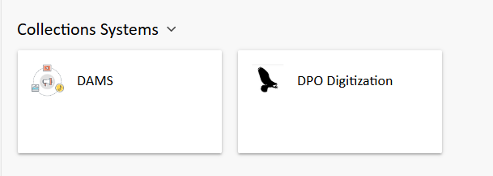

Osprey is accessible inside the SI network, via the VPN, or through the telework site.

A public version is also available at <https://osprey.si.edu>. However, the public version does not have image previews.

Upon accessing Osprey, the main page will show an overview of highlighted projects and links to access other DPO supported projects.

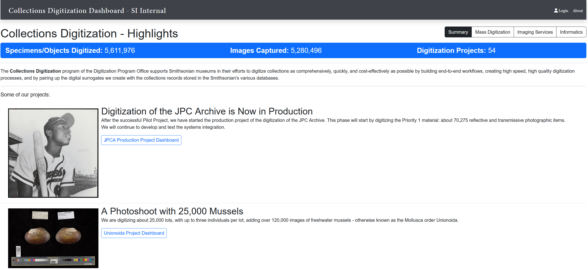

## Finding a Specific Project in Osprey

Information about any DPO supported Mass Digitization, Imaging Services, or Informatics project will display on Osprey.

A selection of highlighted projects displays on the main page. A full listing of available projects is accessed via each of the buttons located on the upper right portion of the screen.

<!--NOTE: REMOVED IMAGE -->

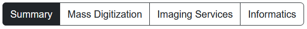

## Reviewing Project Details

Clicking the buttons at the upper right of the screen will reveal a list of DPO supported projects that are tracked in Osprey.

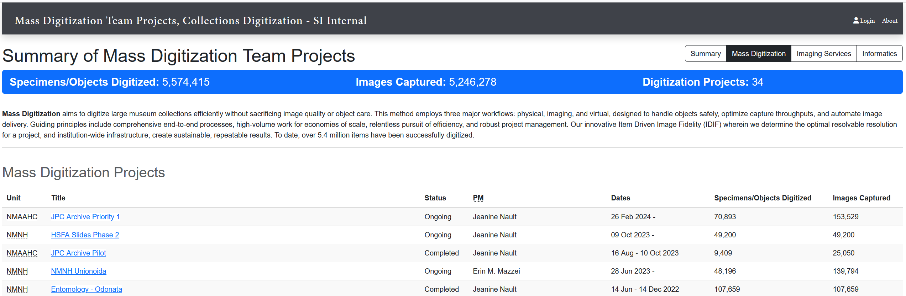

Selecting a project from the list, for example, “NMNH Unionoida”, will display detailed information about the digitization progress of the project.

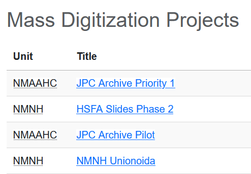

The top of the individual project dashboard displays project information, relevant links, a summary of the digitization totals, as well as any immediate issues that require attention.

**Statistics and information for each Osprey project are updated several times a day. The update rate can be increased as needed, on a project-by-project basis.**

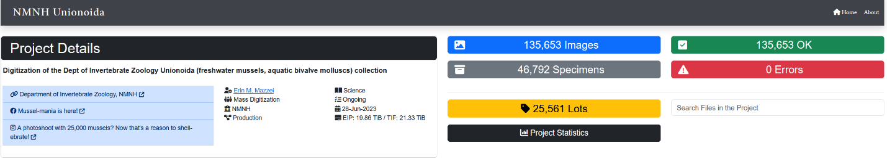

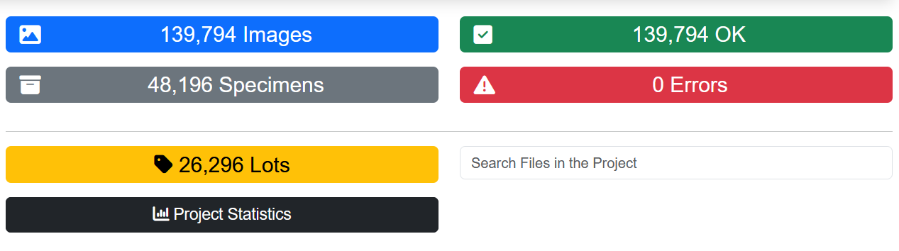A selection of key summary statistics is available at the upper right part of the screen:

*  The blue box lists the total number of TIFF/RAW image pairs

- The gray box lists the total number of specimens/objects

- The green box lists the number of validated/processed images

- The red box lists any errors – note that this number will clear once the errors are resolved

- The yellow box lists the number of project specific lots/folders/batches

- The black box links to more detailed statistics, which is covered in the next section

## Reviewing Project Statistics

Click on the “Project Statistics” button to view more details on the project

The statistics listed on the project page are repeated at the top of the “Project Statistics” page, but additional details relevant to the project are also available, for example:

- Specimens Digitized by Day

- Digitization to Delivery Interval

- DPO Ingest to Visual QC Interval

- Visual QC to DAMS Ingest Interval

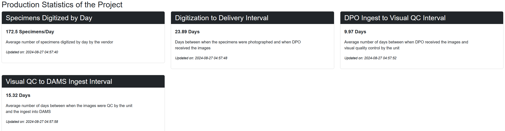

Bar graph visualizations of the data are available on the Project Statistics page to show the progress of that data series during the project:

- Specimens Digitized by Day

- Digitization to Delivery Interval

- DPO Ingest to Visual QC Interval
  
- Visual QC to DAMS Ingest Interval

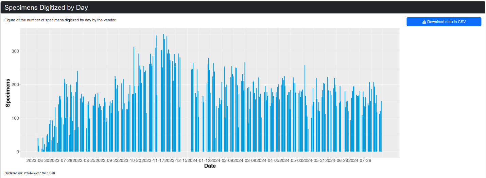

Clicking on the “Download data in CSV” button in the upper right will save the data to your local drive

## Reviewing File Details

### How Osprey Processes Files

Files in Osprey are organized into batches, which are listed as folders on the left-side sidebar of the project details page.

Batch sizes will vary and can be generated at varying frequencies depending on the project needs.

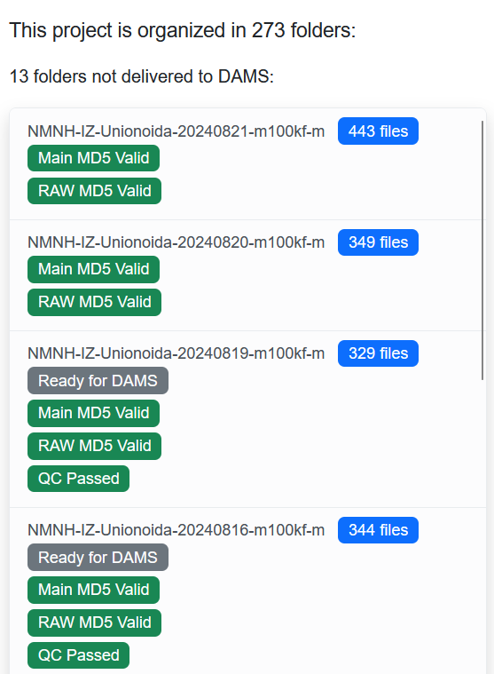

Project media is tracked in Osprey as it progresses from initial automatic file checks to final DAMS ingest and displayed as tags.

In Osprey, media goes through three stages of processing:

1.  **File Checks**

    1.  Automatic file checks to ensure the integrity of the media

2.  **Lightbox**

    1.  Image previews of the media in the folder

3.  **Post-production**

    1.  Automatic process to check if the file is ready for DAMS ingest, then reporting when the file is ingested by DAMS

    2.  Tracks other tasks specific to each project, which can include linking the images to the Collections Information System (CIS), or other systems.

If you click on a folder, you can review the processing stages, along with any issues, in more detail.

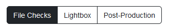

**Any folders that have either incomplete processes or errors will display in the left-side sidebar. This is covered in more detail in the “Folder Review” section of the guide.**

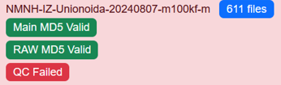

**Note: The tabs that display for a given project, particularly the “Post-Production” tab, can be customized to report on any stage in the digitization process,** **as long as DPO has view access to the folders or database where the relevant information resides.**

Automatic file checks and processing are performed multiple times per day by an integrated back-end program called “Osprey Worker”. **The only exception is the Johnson Publishing Company Archive project (JPCA), which processes the files weekly.**

Any folders that have been fully processed and are fully ingested into DAMS, are removed from the list in the left-side sidebar, but are still viewable, via the dropdown list at the bottom-left of the page, just below the left-side sidebar.

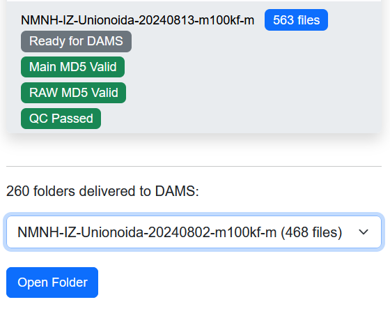

Selecting a DAMS-delivered folder from the dropdown list and pressing the “Open Folder” button will allow inspection of the media in that specific folder.

### Folder Review

Any folders that are either still being processed or have errors will display in the left-side sidebar.

The color of the label indicates the type of issue:

- A red label is a critical issue that requires resolution.

- A gray label is usually temporary and indicates that the process is still incomplete.

- A green label means everything is ok.

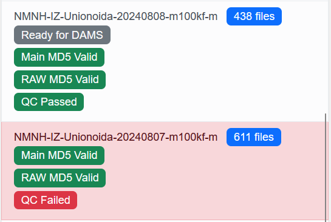

If you click on the folder with the red or gray label, you can review any issues in more detail.

**Note: If a red label appears, then, until the issue is resolved, further processing stops for <u>all</u> the items in the folder.**

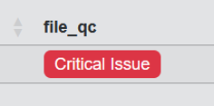

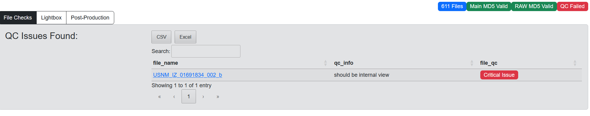

### Examining Individual File Details

Clicking on any media file within a folder will display the details about the image:

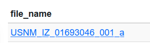

- Image Preview

- Filename

- File Technical Checks

- Remaining File Postprocessing Steps

- Embedded Metadata

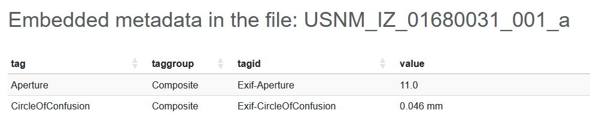

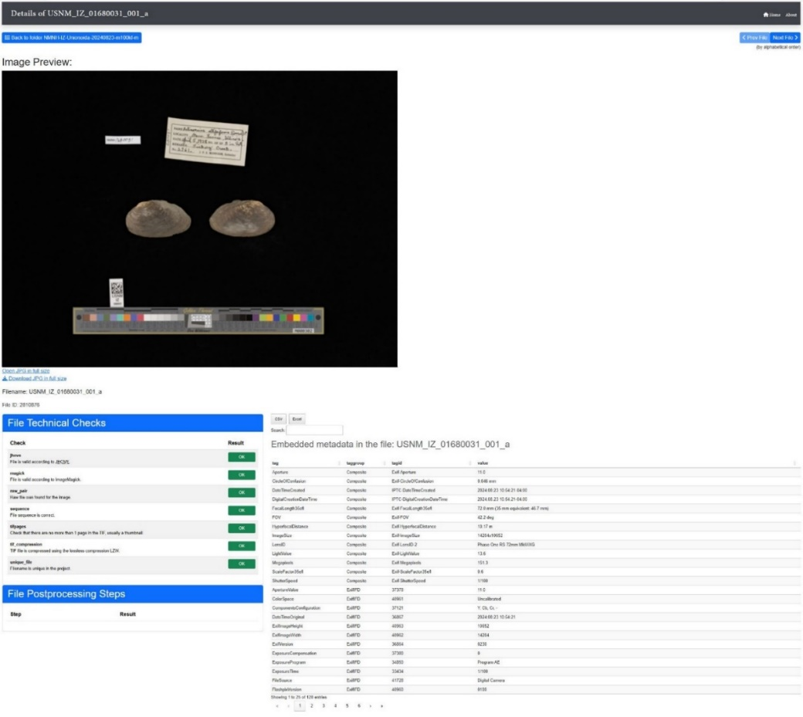

If the file is examined prior to DAMS ingest, then the information listed in the embedded metadata represents the information that will be added once the DAMS ingest occurs

**NOTE: Osprey only displays and evaluates the media child/derivative file**

- Parent/raw files are not checked for integrity in the File Technical Check section

- Any embedded metadata associated with the parent/raw files is not displayed in the Embedded Metadata information section

**NOTE: The preview images are stored offline after 90 days as part of the routine maintenance of the system. Contact DPO to keep specific images online for longer.**

Under "File Postprocessing Steps", once the image is checked ready for DAMS ingest, then the "in_dams" "Result" box is marked "Completed"

Once the image is ingested into DAMS, then then the "ready_for_dams" box is marked "Completed"

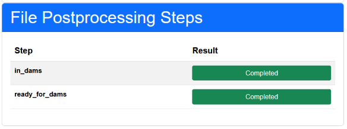

**Note that for most projects, the standard DAMS ingest timeframe is 1 week. This timeframe may be modified for specific projects, such as the Johnson Publishing Company Archive (JPCA), which ingests every 24 hours**

### Project QC and Remediation

Osprey provides an Image Quality Inspection Review (QC) portal for any unit subject matter expert working on a DPO supported project.

To access the QC section of Osprey, you need to log in via the link at the upper right of the web page.

 

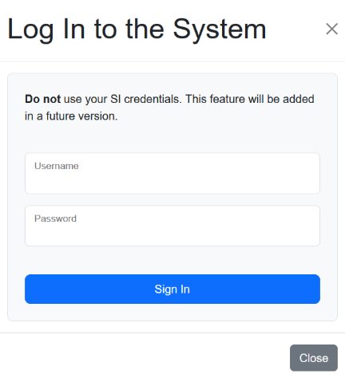

**Note: Osprey currently requires a separate login from your SI credentials. If you do not have an Osprey login, contact Luis Villanueva <villanueval@si.edu>.**

Upon logging in, a list of assigned projects is displayed:

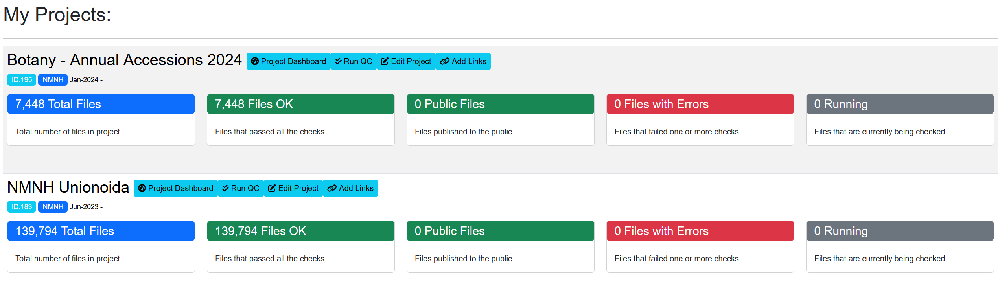

The following options are available for each project:

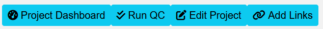

- **Project Dashboard:** Returns you to the project dashboard covered in the “Reviewing Project Details” section

- **Run QC:** Starts the Image Quality Inspection Review (QC) process

- **Edit Project:** <u>Only accessible to DPO Project Managers</u>. Allows changes to the project name, description, and URL. Contact the DPO Project Manager to change the project name or description.

- **Add Links**: <u>Only accessible to DPO Project Managers</u>. Allows addition of URL links to the project page. Contact the DPO Project Manager to add or change the any relevant web links.

Clicking on a project’s “Run QC” button opens the Image Quality Inspection Review (QC) page:

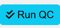

Any folders that have not get gone through QC are listed at the top, followed by those that have completed QC below.

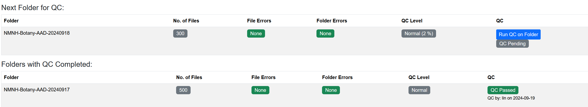

Clicking on the “Run QC on Folder” button starts the folder QC process.

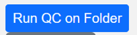

The QC page will then prompt you to review a selection of images in the folders. The percentage of total images reviewed is based on the sampling level for the phase of the project. For additional information on the sampling levels, consult the specific project Virtual Workflow documents.

Once QC has started in a folder, Osprey automatically assigns that folder to the user login. Your QC progress is saved, so if you stop in the middle of the folder, then QC can resume at a later time.

For each reviewed image, there is an option to select the following options:

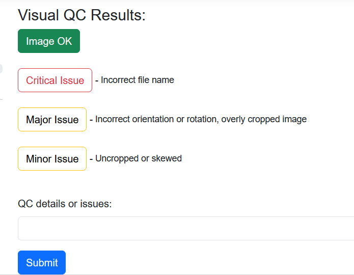

<!--NOTE: REMOVED IMAGE 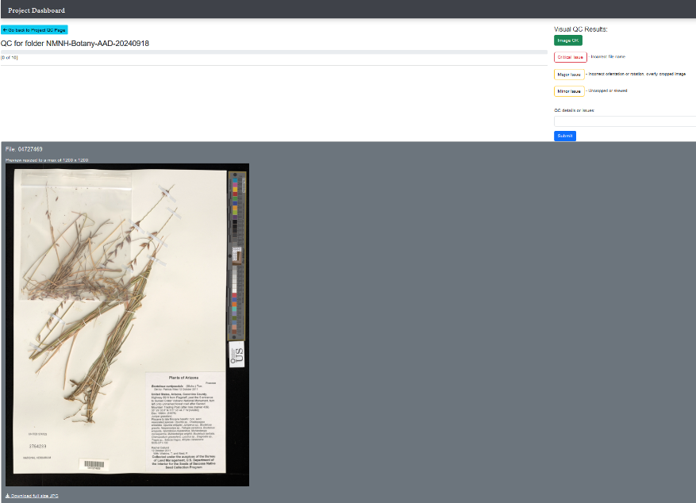-->

The number of images rejected as “Critical Issue”, “Major Issue”, or “Minor Issue” will affect the level of Image Quality Inspection Review (QC) for the project.

If a certain percentage of images are rejected within a folder, then the entire contents of the folder will need to be remediated.

Additional comments related to the Image Quality Inspection Review (QC) can be left in the free text “QC details or issues” field.

## Search Function

Osprey has a search function available within each project dashboard.

You can type in a full or partial file name and the corresponding results will display.

For example:

- Searching on the full file name “USNM_IZ_01680031_001_a” will bring back the image preview, File Technical Checks, and Embedded Metadata Information about that one image.

- Searching on a partial file name, like “USNM_IZ_0168”, will bring back all images that match the partial name. The results list will contain links to the image preview, File Technical Checks, and Embedded Metadata Information about each matching image.

## Additional Questions About Osprey?

Contact the DPO Informatics Team:

- Luis J. Villanueva <villanueval@si.edu>

- Corey DiPietro <dipietroc@si.edu>
