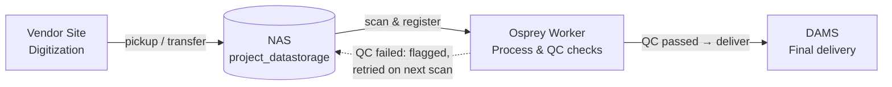

# Vendor-to-DAMS file process

High-level flow of how a digitized file batch moves through Osprey, from
vendor pickup to delivery in DAMS.

## Stages

- **Vendor Site** — the vendor digitizes (scans/photographs) the
  collection materials and produces the digital files.
- **NAS (`project_datastorage`)** — files are picked up/transferred onto
  the NAS, landing in the project's folder structure that Osprey scans.
- **Osprey Worker** — re-scans every project folder on each run,
  registers files, and runs the configured checks (filename check
  against reference data, QC). See `osprey/services/file_checks.py` and
  the `Osprey_Worker` `pipeline.py`.
- **DAMS** — folders that pass QC are delivered and marked
  `delivered_to_dams`; folders with errors stay on the NAS and are
  re-checked automatically on the worker's next scan (no manual
  resubmission needed), per `_check_folder_skip_conditions` in
  `pipeline.py`.

*Diagram generated 2026-09-16. Source: Osprey web_app codebase
(`file_checks.py`, `Osprey_Worker/worker/pipeline.py`) plus vendor →
NAS → DAMS pipeline description.*
